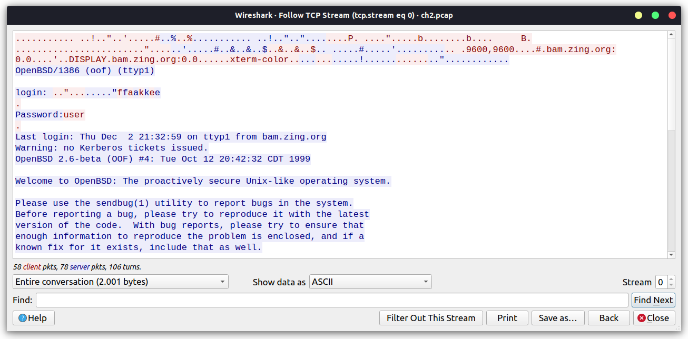

## TELNET - authentication Write Up

### Tools

- wireshark

### walk through

1. Run wireshark
2. Open file ch2.pcap
3. Type TELNET in filter section
4. Right click and choose follow > TCP Stream

### Answer

The answer is password it's self

